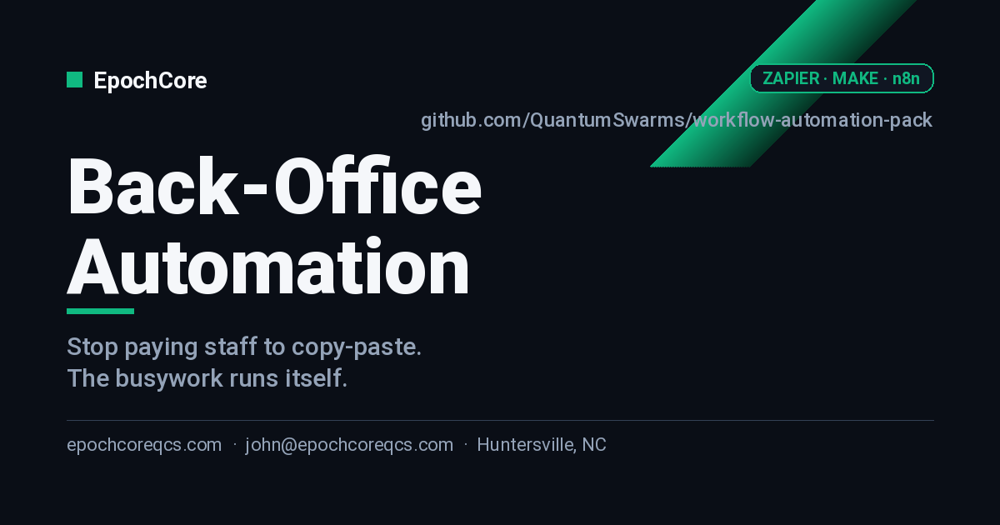

# Back-Office Automation for SMBs

> Stop paying staff to copy-paste. We connect your invoicing, CRM, scheduling, and email so the busywork runs itself.

---

## Who this is for

SMBs whose team spends 5+ hours a week on data entry between QuickBooks, their CRM, scheduling tool, and email — owners who know it's wasteful but haven't had time to fix it.

## What you get

- 5–20 hours per week of staff time recovered, measured with a before/after time log.
- Errors from copy-paste eliminated (typo'd invoices, missed follow-ups, double-bookings).
- Owner gets a weekly digest email summarizing operations without opening 6 tabs.
- A documented automation map you own — no vendor lock-in beyond the SaaS you already use.

## Pricing

| Tier | Price | What's included |
|---|---|---|
| **Quickwin** | $3,500 | One process audit + 2 automations + dashboard. ~10 business days. |
| **Operations Pack** | $8,500 | Up to 5 automations, owner dashboard, team training, 30-day support. |
| **Fractional Ops** | $2,200/mo | Ongoing automation buildout + monthly review (3-month minimum). |

> Prices are starting points. Final scope confirmed in a free 30-min discovery call. Net-15 invoicing, 50% on signing for fixed-price tiers.

See [`docs/pricing.md`](./docs/pricing.md) for full breakdown, payment terms, and FAQ.

## Engagement timeline

- **Week 1** — Shadow + map + automation plan signed off.
- **Week 2** — Build + test in a sandbox.
- **Week 3** — Roll out, train, measure.

Full engagement details in [`docs/scope.md`](./docs/scope.md) and [`docs/deliverables.md`](./docs/deliverables.md).

## How to engage

1. **Open an [Engagement Inquiry](../../issues/new?template=engagement-inquiry.yml)** — takes 2 minutes.
2. We respond within **1 business day** with a 30-min discovery call.
3. After the call, you get a written proposal in 48 hours.

Prefer email? **john@epochcoreqcs.com** with subject `[INQUIRY] workflow-automation-pack`.

## About EpochCore

EpochCore LLC is based in **Huntersville, NC**, serving SMBs across the Charlotte / Lake Norman region (and remote nationally). Founder John has shipped infrastructure for quantum computing platforms, IBM Watson.x agents, and enterprise cloud — now bringing that engineering rigor to SMB consulting.

- 🌐 [epochcoreqcs.com](https://epochcoreqcs.com)
- 📧 john@epochcoreqcs.com
- 📍 Huntersville, NC

## Documentation

- [`docs/scope.md`](./docs/scope.md) — what's in and out per tier
- [`docs/pricing.md`](./docs/pricing.md) — full pricing, payment, FAQ
- [`docs/intake-checklist.md`](./docs/intake-checklist.md) — what we need from you at kickoff
- [`docs/deliverables.md`](./docs/deliverables.md) — concrete artifacts you receive
- [`SETUP.md`](./SETUP.md) — internal note for builders editing this repo
- [`CHANGELOG.md`](./CHANGELOG.md) — versioned changes to this offering

## License

This repository is **proprietary** and made public for marketing purposes only. See [`LICENSE`](./LICENSE).
